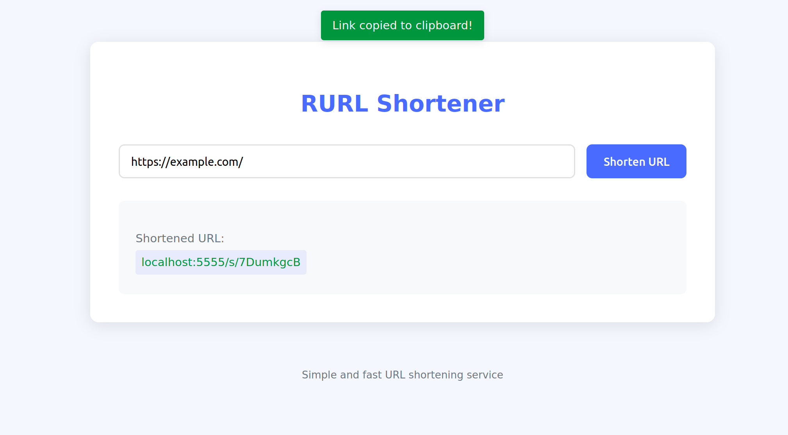
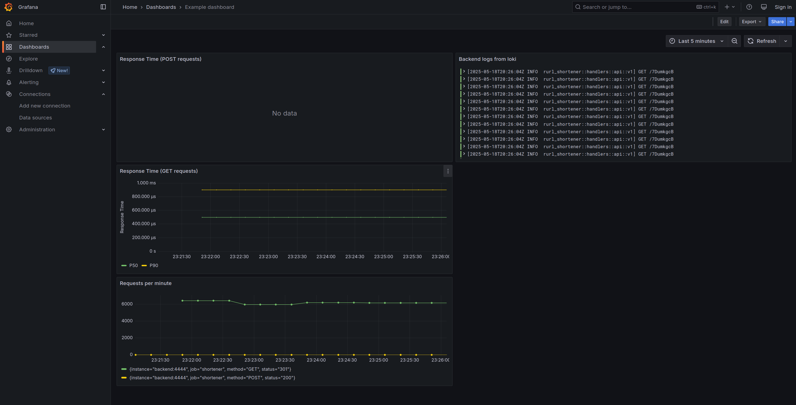

[](https://github.com/mkornaukhov03/rurl-shortener/actions/workflows/backend.yaml)

# Rust URL shortener

## How to run
Just
```bash
docker compose up
```

There is a feature: AI-generating short links. We use `openrouter` with `llama` model. You may provide openrouter token via env, see `docker-compose.yaml`.

## Usage
By default, it deploys frontend on `4444` port:


Grafana is deployed on port `3000`:


## General Architecture
TODO

## Telemetry Architecture
TODO
